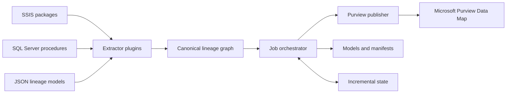

# Purview Lineage Extractor

Purview Lineage Extractor is a config-driven Python utility that extracts
technical lineage from ETL metadata, normalizes it into a versioned graph, and
publishes it to Microsoft Purview Data Map.

Built-in extractors support SQL Server Integration Services (SSIS) packages,
SQL Server stored procedures, and pre-generated JSON lineage models. The plugin
contracts allow additional ETL platforms and catalog publishers to be added
without changing the orchestration layer.

## Features

- Run multiple lineage jobs from one YAML configuration.
- Extract table-level and column-level lineage from SSIS `.dtsx` packages.
- Parse SQL Server `INSERT ... SELECT` stored procedures with Microsoft
  ScriptDom and a strict `sqlglot` fallback.
- Capture direct mappings, scalar expressions, joins, and referenced source
  columns.
- Publish SQL tables, columns, and processes to Microsoft Purview.
- Reuse stable entity identities so repeated runs update rather than duplicate.
- Skip unchanged publications using deterministic graph fingerprints.
- Isolate failures by package or stored procedure.
- Generate canonical model files and run manifests for auditability.
- Discover third-party extractors and publishers through Python entry points.
- Authenticate without embedded secrets using Azure Identity.

## Architecture



Every extractor emits the same schema-versioned graph of assets, fields,
processes, edges, and field mappings. Publishers consume that graph without
depending on source-specific parser details.

## Supported sources

| Extractor | Input | Lineage coverage |
|---|---|---|
| `ssis` | SSIS `.dtsx` files | Data flows, source and destination tables, columns, mappings, and transformation expressions |
| `sqlserver-stored-procedure` | SQL Server procedure definitions | Permanent-table `INSERT ... SELECT`, aliases, joins, cross-database references, and scalar expressions |
| `json-model` | Canonical lineage JSON | Assets, fields, processes, edges, and field mappings supplied by another system |

## How the pieces work together

A lineage run moves through the project in this order:

1. **CLI** reads the command and YAML configuration.
2. **Orchestration** expands environment variables, resolves paths, and creates
   the configured jobs.
3. **Plugin registry** selects the required extractor and publisher
   implementations.
4. **Extractor** discovers source targets and parses each package, procedure, or
   JSON model.
5. **Domain model** validates the result and creates a deterministic
   fingerprint.
6. **Runner** writes the canonical model and manifest, then checks state to
   determine whether publication is required.
7. **Purview publisher** maps the canonical graph to Atlas entities, publishes
   them, and reads them back for verification.
8. **Observability** records progress and failures throughout the run.

The `plan` command stops after writing models and manifests. The `run` command
continues through publication and updates incremental state after success.

## Repository guide

```text
purview-lineage-extractor/
  configs/
  docs/
  scripts/
  src/lineage_utility/
    contracts/
    domain/
    extractors/
      ssis/
      sqlserver/
      json_model.py
    orchestration/
    plugins/
    publishers/
      purview/
    schemas/
    observability/
    cli.py
    __main__.py
  tests/
  pyproject.toml
  MANIFEST.in
  README.md
```

### Root folders and files

| Path | What it does | Why it is useful |
|---|---|---|
| `configs/` | Contains the example YAML configuration for runtime paths, publishers, and extraction jobs. | Operators can add sources or change deployment settings without modifying Python code. |
| `docs/` | Contains detailed extension guidance, including plugin authoring. | Keeps contributor documentation separate from the main getting-started guide. |
| `scripts/` | Contains convenience wrappers such as `run-lineage.ps1`. | Makes scheduled tasks and Windows operations easier while still using the same Python CLI. |
| `src/lineage_utility/` | Contains the installable application package. | Keeps application code isolated from configuration, documentation, and tests. |
| `tests/` | Contains parser, domain, orchestration, plugin, and Purview mapping tests plus safe local fixtures. | Verifies behavior without requiring a live Purview account. |
| `pyproject.toml` | Defines package metadata, pinned dependencies, optional integrations, and the `lineage-util` command. | Provides reproducible installation and build behavior. |
| `MANIFEST.in` | Declares non-Python files that must be included in source distributions. | Ensures schemas, examples, documentation, and fixtures are packaged correctly. |
| `README.md` | Provides installation, configuration, operation, and architecture guidance. | Gives users and contributors one public entry point into the project. |

### Application package

| Path | What it does | How it fits into the big picture |
|---|---|---|
| `contracts/` | Defines the interfaces for extractors, publishers, credentials, and state stores. | Decouples components so new ETL sources or catalog targets can be added without changing the runner. |
| `domain/` | Defines assets, fields, processes, mappings, serialization, validation, and fingerprinting. | Acts as the shared language between every extractor and publisher. |
| `extractors/` | Hosts built-in adapters that convert source-specific metadata into the canonical domain model. | Keeps source parsing independent from orchestration and Purview APIs. |
| `extractors/ssis/` | Discovers and parses top-level SSIS `.dtsx` packages, data flows, tables, columns, and expressions. | Provides SSIS lineage while avoiding generated `obj` and `bin` package copies. |
| `extractors/sqlserver/` | Reads stored-procedure definitions through `pyodbc` and parses supported T-SQL with ScriptDom or `sqlglot`. | Produces reliable procedure lineage without requiring a C# project or subprocess. |
| `extractors/json_model.py` | Loads lineage graphs emitted by another application. | Allows any ETL platform to integrate by producing the canonical JSON contract. |
| `orchestration/` | Loads configuration, coordinates targets, handles failure isolation, writes manifests, and manages incremental state and locking. | Turns individual parsers and publishers into a repeatable multi-job utility. |
| `plugins/` | Registers built-in components and discovers external Python entry points. | Enables modular extension without hard-coding every implementation into the CLI. |
| `publishers/purview/` | Handles Azure authentication, Atlas HTTP calls, type definitions, entity mapping, GUID reuse, retries, and read-back verification. | Isolates all Microsoft Purview behavior behind the publisher contract. |
| `schemas/` | Bundles the machine-readable contracts for YAML configuration and canonical lineage JSON. | Helps editors, CI pipelines, external producers, and future versions agree on valid document structure. |
| `observability/` | Configures human-readable and JSON logging. | Supports local troubleshooting and centralized production monitoring. |
| `cli.py` | Implements `plugins`, `validate`, `plan`, and `run`. | Provides the user-facing control surface for the entire utility. |
| `__main__.py` | Connects `python -m lineage_utility` to the CLI. | Allows the package to run even when the installed `lineage-util` command is unavailable. |

### What should I modify?

| Role | Usually modify | Usually leave unchanged |
|---|---|---|
| Operator or scheduler owner | `configs/lineage.yml`, environment variables, and deployment scripts | Parsers, domain models, and Purview internals |
| New ETL integrator | A new module under `extractors/`, plugin registration, and tests | Existing extractors and the runner |
| New catalog integrator | A new module under `publishers/`, plugin registration, and tests | Extractors and canonical domain objects |
| Core maintainer | `contracts/`, `domain/`, `orchestration/`, and schemas | Environment-specific configuration |
| Application user | Normally only configuration and CLI commands | Everything under `src/` |

## Requirements

- Python 3.11 or newer.
- Microsoft ODBC Driver 18 or 17 for SQL Server when extracting stored
  procedures.
- Read access to `sys.procedures` and `sys.sql_modules`.
- An Azure identity with permission to manage Purview Data Map entities.
- Permission to manage custom type definitions when `manage_types: true`.

No C# build or subprocess is required.

## Installation

```powershell
git clone https://github.com/jijo-ms/purview-lineage-extractor.git
cd .\purview-lineage-extractor

python -m venv .venv
.\.venv\Scripts\Activate.ps1
python -m pip install --upgrade pip
python -m pip install ".[all]"
```

Install only the integrations required by the deployment:

```powershell
# SSIS and JSON extraction
python -m pip install .

# SQL Server stored-procedure extraction
python -m pip install ".[sqlserver]"

# Microsoft Purview publishing
python -m pip install ".[purview]"
```

For development:

```powershell
python -m pip install -e ".[dev]"
```

### ScriptDom discovery

ScriptDom is the preferred T-SQL parser. The utility searches:

1. The configured `scriptdom_dll` path.
2. The `SCRIPTDOM_DLL` environment variable.
3. Local NuGet package caches.
4. Common installed locations.

If ScriptDom cannot be loaded, the utility uses `sqlglot` with its T-SQL
dialect. The fallback is intentionally strict and rejects SQL shapes it cannot
model safely.

## Quick start

Create a working configuration from the example:

```powershell
Copy-Item .\configs\lineage.example.yml .\configs\lineage.yml
```

Set the Purview account name. Authentication uses the Azure Identity credential
chain by default:

```powershell
$env:PURVIEW_ACCOUNT = "my-purview-account"
az login
```

Edit `configs\lineage.yml` to point to the SSIS package directory and SQL
Server objects to extract. Paths are resolved relative to the YAML file.

Validate, preview, and run:

```powershell
lineage-util plugins
lineage-util validate --config .\configs\lineage.yml
lineage-util plan --config .\configs\lineage.yml
lineage-util run --config .\configs\lineage.yml
```

`plan` performs extraction and writes models and a manifest without publishing
or advancing incremental state. Review the generated models before the first
`run`.

## Configuration

```yaml
version: 1

runtime:
  output_dir: ../artifacts/models
  state_file: ../artifacts/state.json
  manifest_dir: ../artifacts/manifests

publishers:
  purview:
    plugin: purview
    account: ${PURVIEW_ACCOUNT}
    auth:
      type: ${PURVIEW_AUTH_TYPE:-default}
    manage_types: true
    allow_process_fallback: true

jobs:
  - name: ssis-packages
    extractor: ssis
    source:
      path: ${SSIS_PACKAGE_DIR:-../tests/fixtures}
      include: "*.dtsx"
      exclude: ["*.disabled.dtsx"]
    publishers: [purview]
    continue_on_error: true

  - name: warehouse-procedures
    enabled: false
    extractor: sqlserver-stored-procedure
    source:
      server: '${SQLSERVER_HOST:-localhost}'
      database: ${SQLSERVER_DATABASE:-Warehouse}
      schema: ${SQLSERVER_SCHEMA:-dbo}
      backend: auto
      procedures:
        - usp_LoadOrders
    publishers: [purview]
    continue_on_error: true
```

Environment variables use `${NAME}` for a required value and
`${NAME:-default}` for a value with a default. Keep credentials out of YAML.

An SSIS directory scan is top-level only, which prevents generated `obj` and
`bin` copies from being parsed. Each package and stored procedure is an
independent target, so one failure does not suppress successful siblings.

## Commands

| Command | Purpose |
|---|---|
| `lineage-util plugins` | List available extractor and publisher plugins |
| `lineage-util validate --config <file>` | Validate configuration and construct plugins |
| `lineage-util plan --config <file>` | Extract models without remote writes |
| `lineage-util run --config <file>` | Extract and publish configured jobs |
| `lineage-util run --config <file> --job <name>` | Run one named job |
| `lineage-util run --config <file> --force` | Publish even when fingerprints are unchanged |
| `lineage-util run --config <file> --fail-fast` | Stop after the first failed target |

Use `--log-format json` for machine-ingested logs. Any failed target produces
exit code 1.

The PowerShell wrapper exposes the common workflow:

```powershell
.\scripts\run-lineage.ps1 -Config .\configs\lineage.yml -Plan
.\scripts\run-lineage.ps1 -Config .\configs\lineage.yml -Job ssis-packages
```

## Purview publication

The publisher:

- creates required custom process type definitions when enabled;
- publishes physical SQL assets as `mssql_table` and `mssql_column`;
- attaches column mappings and transformation expressions to process entities;
- preserves process GUIDs through deterministic qualified names;
- retries bounded transient Atlas API failures;
- falls back to generic DataSet entities when configured; and
- reads entities back to verify inputs, outputs, and column mappings.

Authentication supports:

| `auth.type` | Recommended use |
|---|---|
| `default` | Workload identity, environment credential, managed identity, or local Azure CLI |
| `managed_identity` | Azure-hosted system-assigned or user-assigned identity |
| `azure_cli` | Explicit local development with `az login` |

Tokens use the `https://purview.azure.net/.default` scope.

## Stored-procedure SQL scope

Supported:

- Permanent-table `INSERT ... SELECT`.
- Aliases and cross-database table names.
- Inner and outer joins.
- Direct column mappings.
- Scalar expressions with one mapping per referenced source column.

Rejected rather than guessed:

- Dynamic SQL.
- Temporary tables.
- Common table expressions.
- Set operators.
- Nested queries and unsupported statement shapes.

This conservative behavior prevents uncertain lineage from being published as
fact.

## Canonical lineage model

The version `1.0` model contains:

- assets and fields;
- processes with typed input and output edges;
- field mappings associated with a process; and
- source attributes and operational metadata.

Validation rejects duplicate identities, invalid edges, missing fields, and
duplicate mappings. Fingerprints exclude operational metadata so run IDs and
parser diagnostics do not trigger catalog writes.

The JSON Schema is available at
`src\lineage_utility\schemas\lineage-graph-v1.schema.json`.

## Adding another ETL

External Python packages can register factories in these entry-point groups:

- `lineage_utility.extractors`
- `lineage_utility.publishers`

See [`docs/plugin-authoring.md`](docs/plugin-authoring.md) for the contracts and
a complete example. A system that already emits the canonical JSON schema can
use the `json-model` extractor without implementing a Python plugin.

## Development

```powershell
python -m compileall -q src tests
python -m pyflakes src tests
python -m pytest
python -m build
```

The test suite does not require a live Purview account. Live SQL Server and
Purview checks should use isolated non-production resources.
